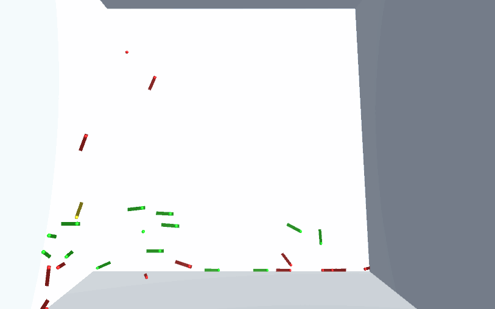

# QuidditchSim
A simplified quidditch simulator where the only ball used is the snitch.

Here are the rules of the game:
- Players fly around a stadium and attempt to score 1 point by catching the golden snitch.
- Successive catches are worth 2 points. 
- The first team to 100 points wins.

# Demo


# Simulation details
- Everything are implemented as spheres with a velocity indicator.
- Players try to avoid walls (by gravitating towards the center of the arena) and friendly players.
- Players try to touch the snitch, which moves smoothly, but randomly.
- Each player has some traits: aggressiveness, max exhaustion, max velocity, weight, and current exhaustion. These traits follow normal distribution.
- Players get more exhausted when they are moving, and are exhausted when their current exhaustion reaches their max. After this, they have to rest for 3 seconds.
- Players colliding with the walls, or sometimes with other players, become unconscious and fall to the floor, where upon contact, they will be brought to their starting sphere.
- The chance of becoming unconscious when hitting another player depends on exhaustion and aggression (higher aggression is better, lower current exhaustion is better). There's only a small chance of becoming unconscious when hitting another player on the same team (5%).
- The teams each have a unique trait: Slytherins can't control their brooms too well, and they oscillate. Gryffindor is friendly, so a friendly collision speeds both parties up.

# How to use
### Prerequisites
1) [Unity3d (2019.4.20)](https://unity3d.com/get-unity/download/archive) [required].
### Get the repo
```git clone https://github.com/tgm043/QuidditchSim.git```
### Open the sample scene
```Unity/QuidditchSim/Assets/Scenes/SampleScene.unity```
